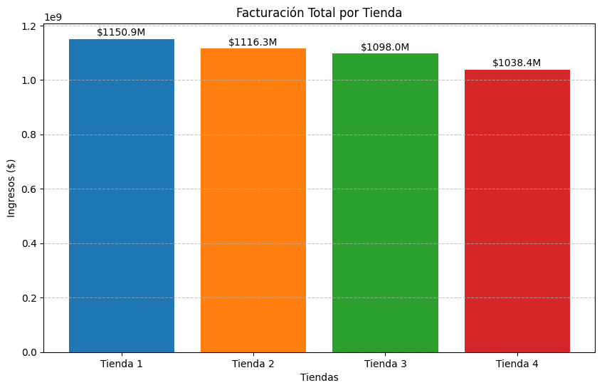
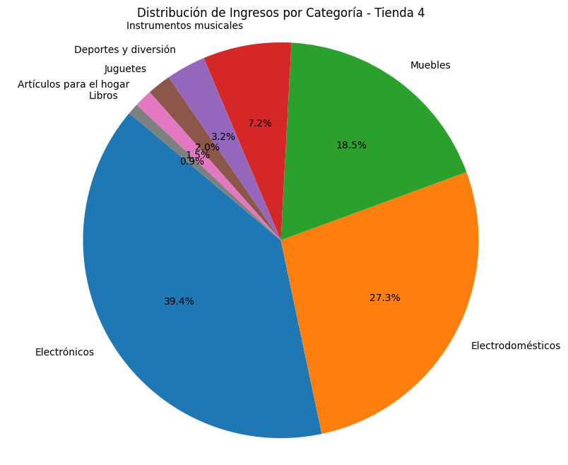
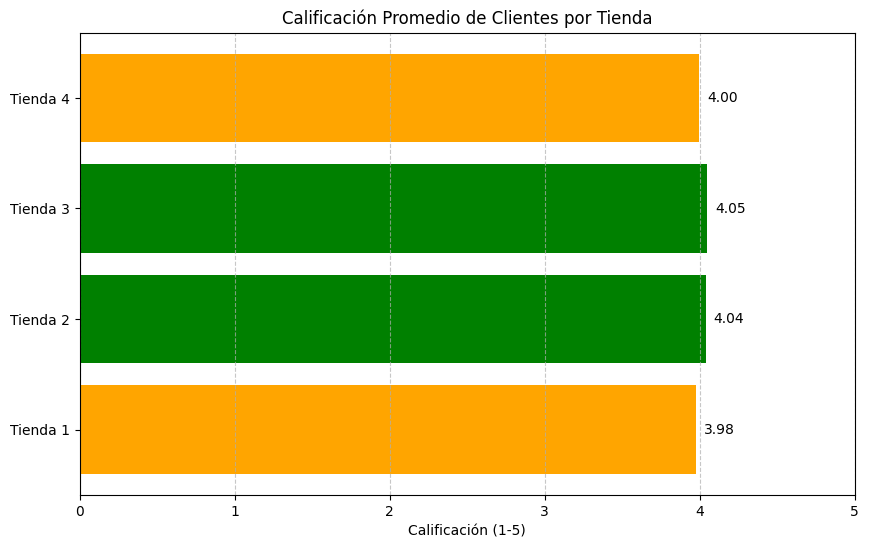

# Challenge Alura Store: Análisis de Ventas y Eficiencia

Este proyecto es una solución al Challenge 1 de Data Science de Alura Latam. El objetivo principal es analizar los datos de ventas de cuatro tiendas diferentes de la cadena "Alura Store" para determinar cuál de ellas es la menos eficiente y, por ende, candidata a ser vendida para iniciar un nuevo emprendimiento.

## Propósito del Análisis

El Sr. Juan, dueño de la cadena Alura Store, busca liquidar uno de sus locales para obtener capital. Para tomar la decisión correcta, se requiere un análisis basado en datos que considere:

1. Facturación Total: ¿Cuál tienda genera menos ingresos?
2. Categorías de Productos: ¿Qué se vende más y en qué tienda?
3. Satisfacción del Cliente: ¿Cuáles son las calificaciones promedio?
4. Rendimiento de Envíos: ¿Cuáles son los costos logísticos promedios?
5. Productos Top: Identificar los artículos más y menos vendidos.

## Tecnologías y Herramientas Utilizadas

* Python 3.x: Lenguaje de programación principal.
* Pandas: Manipulación y análisis de datos (DataFrames).
* Matplotlib: Creación de visualizaciones gráficas.
* Google Colab / Jupyter Notebook: Entorno de desarrollo interactivo.

## Estructura del Proyecto

El repositorio contiene los siguientes archivos principales:

* AluraStoreLatam.ipynb: Script de Python con todo el código de análisis y gráficos
* README.md: Documentación del proyecto
* Base-de-datos-challenge1-latam: Carpeta sugerida para guardar la base de datos utilizada en el proyecto
* InformeFinal: Informe final del proyecto

### Insights y Visualizaciones

A continuación, se presentan los hallazgos clave del análisis realizado en Python.

#### 1. Facturación Total por Tienda

* Comparativa de los ingresos generados por cada una de las cuatro sucursales.

* Hallazgo: La Tienda 4 presenta la facturación total más baja de todas, superada ampliamente por la Tienda 1 y la Tienda 2.

* Conclusión: En términos de ingresos brutos, la Tienda 4 es la menos eficiente.

#### 2. Distribución de Ventas por Categoría

* Análisis de qué tipos de productos generan más ingresos en la tienda menos eficiente (Tienda 4).

* Hallazgo: Las categorías de Electrónicos y Muebles dominan las ventas, pero el volumen general es bajo comparado con otras sucursales.

#### 3. Calificación Promedio de Clientes

* Evaluación de la satisfacción del cliente basada en reseñas del 1 al 5.

* Hallazgo: Aunque todas las tiendas tienen buenas calificaciones (superiores a 4.0), la satisfacción por sí sola no compensa la baja facturación de la Tienda 4.

#### 4. Otros Hallazgos

* Costo de Envío: La Tienda 4 tiene un costo de envío promedio competitivo, descartando la logística como la causa principal de su bajo rendimiento.

* Productos: El producto más vendido en la tienda general es la "Cama box" y artículos de electrónica como el "Iphone 15".

## Instrucciones para Ejecutar el Proyecto

Si deseas reproducir el análisis en tu propia máquina:

**Requisitos previos:**

Tener Python instalado y las librerías necesarias.

**Instalación de dependencias:**

Abre tu terminal y ejecuta el siguiente comando:

* pip install pandas matplotlib

**Ejecución:**

* Opción A: Descarga el archivo AluraStoreLatam.ipynb y ejecútalo con python AluraStoreLatam.ipynb.

* Opción B: Copia el código provisto y pégalo en una celda de Google Colab o Jupyter Notebook, luego ejecuta las celdas secuencialmente.

## Conclusión y Recomendación

Basado en el análisis integral de ingresos, categorías, calificaciones y costos operativos, la recomendación final para el Sr. Juan es:

### Vender la Tienda 4

La Tienda 4 demuestra ser la menos eficiente en términos de generación de ingresos y volumen de ventas. Aunque mantiene un nivel de servicio aceptable, su baja rentabilidad la convierte en la candidata ideal para la venta, permitiendo reinvertir el capital en las sucursales de mayor rendimiento (Tienda 1 y Tienda 2).

---
**Desarrollado por:** Esteban Alonso Molina Morales

**Curso:** Practicando Python para Data Science: Challenge Alura Store
